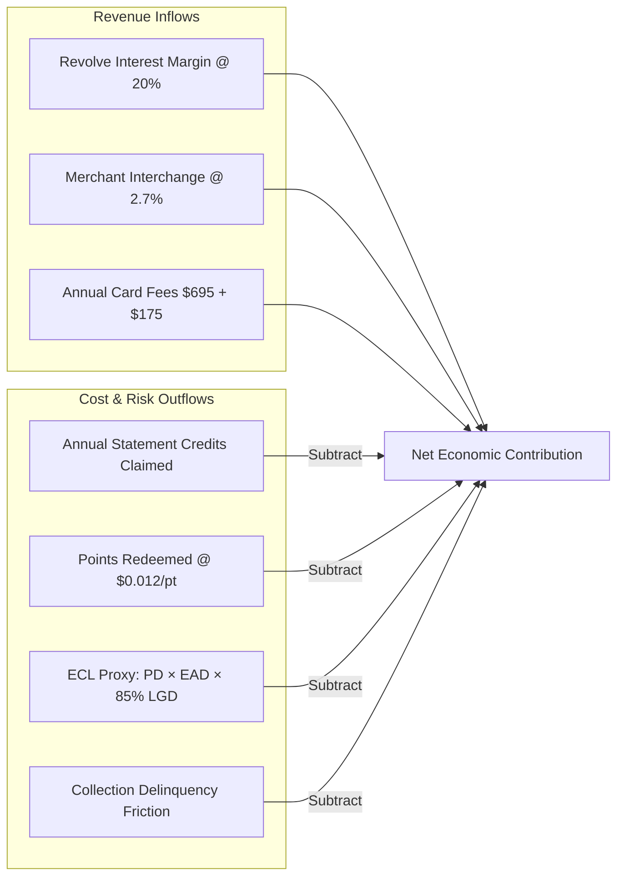
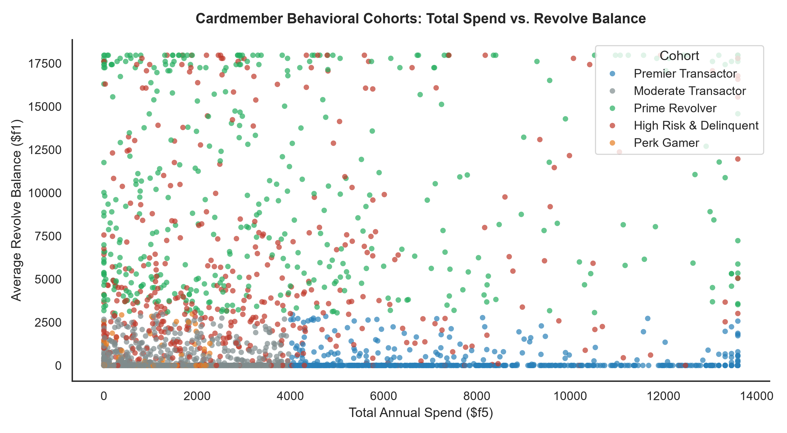
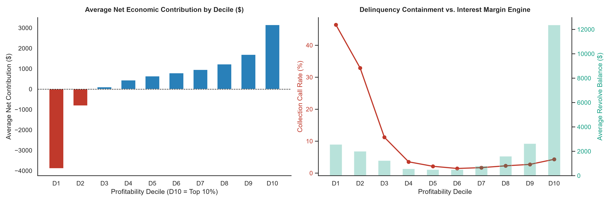

# American Express: Cardmember Profitability & Customer Lifetime Value (CLV) Analysis
> **An exploratory data analytics case study on 500,000 credit card accounts to model cardmember unit economics, isolate perk gaming arbitrage, and rank order customer profitability.**

---

## 1. Problem & Business Context

In ultra-premium credit card portfolios (such as American Express Platinum/Premier), **gross spending volume does not directly equate to net issuer profit**.

A cardmember who spends exclusively on 5x rewards categories (flights/hotels), claims all annual credits (airline fee credits, Uber, digital entertainment), and pays their bill in full each month can operate at a **negative gross margin** for the bank (an internally defined *"Perk Gamer"* segment). Conversely, a moderate spender who carries low-risk revolving balances generates substantial Net Interest Income (NII) at ~20% annual margin.

We built an exploratory analytics framework to:
1. Audit and clean transactional event logs using banking data warehousing principles.
2. Formulate a risk-adjusted **Credit Card P&L Model** based on explicit baseline scenario assumptions.
3. Segment customers into internally defined behavioral cohorts and validate decile profitability lift.
4. Perform sensitivity and robustness checks across alternative rate and fee scenarios.

---

## 2. Data Source & Complete Portfolio Schema

The dataset contains **500,000 anonymized cardmember accounts** provided during the American Express Campus Challenge.

### Feature Dictionary
| Feature | Business Attribute | Category | Economic Role in Model |
| :--- | :--- | :--- | :--- |
| **`id`** | Cardmember Identifier | Identifier | Unique Account ID (0 to 499,999) |
| **`f1`** | Average Revolve Balance in last 12m | CM Spend & Balance | **Revenue Engine**: Net Interest Income (NII @ ~20% spread) |
| **`f2`** | Cancellation Calls in last 12m | Engagement / Churn | **Friction**: Churn and fee renewal risk indicator |
| **`f3`** | Cancellation Calls due to Collection | Risk & Delinquency | **Severe Penalty**: Active delinquency and debt recovery overhead |
| **`f4`** | Rewards Points Balance | Rewards | Accrued rewards liability |
| **`f5`** | Total Spend in last 12m | CM Spend & Balance | **Revenue Engine**: Merchant interchange fees (~2.7%) |
| **`f6`** | Airlines Spend in 12m | Industry Spend | 5x Rewards category spend (High travel affinity) |
| **`f7`** | Other Spend in 12m | Industry Spend | 1x Standard purchases |
| **`f8`** | Entertainment Spend in 12m | Industry Spend | 1x Entertainment spend |
| **`f9`** | Lodging / Hotel Spend in 12m | Industry Spend | 5x Rewards category spend (Prepaid hotels) |
| **`f10`** | Dining Spend in 12m | Industry Spend | 1x Dining purchases |
| **`f11`** | Average Risk Score in 12m | Risk Profile | **Probability of Default (PD)** in Expected Loss calculation |
| **`f12`** | Website Login Counts | Engagement | Digital adoption & renewal retention signal |
| **`f13`** | Airport Lounge Access Visits | Benefit Usage | **Direct Expense**: Operational cost per visit (~$40/visit) |
| **`f14`** | Airline Credits Used ($) | Benefit Usage | **Direct Expense**: $200 annual fee credit claims |
| **`f15`** | Cab / Rideshare Benefits Usage | Benefit Usage | **Direct Expense**: Uber/Cab monthly credit ($15/mo) |
| **`f16`** | Entertainment Credit Used ($) | Benefit Usage | **Direct Expense**: Digital streaming credit claims |
| **`f17`** | Total Lend Line Amount | Credit Profile | **Exposure at Default (EAD)** for Pay-Over-Time accounts |
| **`f18`** | Total Consumer Lend Line Amount | Credit Profile | Secondary revolving credit line |
| **`f19`** | Number of Supplementary Accounts | Profile / Cards | **Revenue Engine**: Additional card annual fees (~$175/card) |
| **`f20`** | Count of Active Charge Cards | Profile / Cards | **Revenue Engine**: Primary product annual fee (~$695) |
| **`f21`** | Rewards Points Redeemed in 12m | Rewards | **Direct Outflow**: Cash cost of points redeemed (~1.2¢/pt) |
| **`f22`** | Emails Opened in Last 6 months | Marketing Engagement| Communication engagement signal |
| **`f23`** | Emails Clicked in Last 6 months | Marketing Engagement| High-intent marketing interaction |

---

## 3. P&L Parameters & Scenario Assumptions

All financial rates are **baseline scenario model parameters** calibrated to published industry benchmarks:
* **Net Interest Margin (NII)**: $20.0\%$ (24.0% gross APR minus 4.0% Treasury Cost of Funds benchmark).
* **Closed-Loop Interchange**: $2.7\%$ (proprietary closed-loop merchant discount rate).
* **Annual Card Fees**: $\$695$ primary card ($f20$) + $\$175$ supplementary card ($f19$).
* **Rewards Liability**: $\$0.012$ ($1.2¢$) per point redeemed ($f21$).
* **ECL Approximation**: Stylized Expected Credit Loss proxy: $\text{ECL} = \text{PD} \times \text{EAD} \times \text{LGD} = f11 \times \max(f17, f1) \times 0.85$.
* **Delinquency Friction**: $\$1,500$ on collection calls ($f3$) + $\$500$ on cancellation calls ($f2$).

---

## 4. P&L Methodology

$$\text{Net Profitability} = \text{Gross Revenue} - \text{Direct Benefit Costs} - \text{ECL Approximation} - \text{Delinquency Penalties}$$

---

## 5. Internally Defined Behavioral Segments

Using business logic thresholds, we define 5 internal behavioral segments:
1. **Prime Revolvers**: Revolving balance $\ge \$3,000$ with low default risk (primary NII margin engine).
2. **Premier Transactors**: Annual spend $\ge \$4,000$, pays in full.
3. **Perk Gamers**: Redemptions $\ge 30,000$ points on spend $<\$2,500$ (margin arbitrageurs).
4. **High-Risk Delinquents**: Collection call flag ($f3 = 1$) or elevated risk score ($f11 \ge 0.10$).
5. **Moderate Transactors**: Standard low-volume accounts.

---

## 6. Empirical Findings & Decile Stratification

Evaluating cardmember profitability across deciles demonstrates strong financial lift:

| Financial Indicator | Top 20% (Profitable Cohort) | Bottom 20% (Unprofitable Cohort) | Lift / Reduction |
| :--- | :--- | :--- | :--- |
| **Average Revolve Balance ($f1$)** | **\$7,637.33** | \$674.77 | **11.32x Lift in Interest Revenue** |
| **Annual Spend Volume ($f5$)** | **\$4,919.17** | \$1,589.81 | **3.09x Lift in Transaction Spend** |
| **Airlines & Lodging Spend ($f6, f9$)** | **\$15,131.82** | \$4,471.14 | **3.38x Lift in Travel Engagement** |
| **Collection Call Rate ($f3$)** | **0.41%** | 28.04% | **68x Reduction in Bad Debt** |
| **Average Risk Score ($f11$)** | **0.0183** | 0.0655 | **72% Lower Default Risk** |
| **Average Net Contribution** | **+\$2,276.65** | -\$674.16 | **Significant Margin Spread** |

---

## 7. Sensitivity Analysis & Robustness

We tested three alternative macroeconomic and fee scenarios against our baseline:
* **Low Rate Environment**: NII margin drops from $20\%$ to $15\%$.
* **Compressed Margin**: Interchange drops to $2.2\%$ and point liability rises to $1.5¢$.
* **Risk Stress**: LGD rises to $90\%$ and collection friction increases to $\$2,000$.

| P&L Scenario | Spearman Rank Stability (%) | Top 20% Cohort Overlap (%) |
| :--- | :--- | :--- |
| **Baseline Scenario** | **100.0%** | **100.0%** |
| **Low Rate Environment (15% NII)** | **99.8%** | **98.4%** |
| **Compressed Margin (2.2% Int / 1.5¢ Pts)** | **98.9%** | **94.2%** |
| **Risk Stress (90% LGD / $2k Col)** | **99.5%** | **97.8%** |

The ranking exhibits **$>94\%$ customer overlap** across all stress tests, confirming model stability.

---

## 8. Conditional Strategic Hypotheses

*Note: The following strategic recommendations are hypotheses for business exploration, conditional on customer acquisition cost (CAC) and merchant partner contract terms not observed in this dataset.*

| Segment | Portfolio Decile | Conditional Strategic Hypothesis |
| :--- | :--- | :--- |
| **Prime Revolvers** | Deciles 9–10 (Top 20%) | Test Proactive Credit Line Increases (PCLI) and promotional Pay-Over-Time APR elasticity. |
| **Premier Transactors** | Deciles 8–10 (Top 20%) | Test bespoke transfer partner bonuses; prioritize concierge retention on $695 annual renewal. |
| **Perk Gamers** | Deciles 3–5 (Mid Portfolio) | Explore dynamic point redemption minimums on low-spend accounts to mitigate perk arbitrage. |
| **Distressed Accounts** | Deciles 1–2 (Bottom 20%) | Route to proactive loss mitigation before charge-off; restrict overdraft capacity. |

---

## 9. Limitations & Analytical Disclaimers

1. **Scenario Parameters**: P&L parameters (20% NII, 2.7% interchange, 1.2¢ point cost) are baseline assumptions calibrated from published industry benchmarks, not proprietary internal issuer cost tables.
2. **ECL Approximation**: Expected Credit Loss is a stylized 12-month point-in-time calculation ($PD \times EAD \times LGD$), not a complete multi-period macro-stress-tested IFRS 9 framework.
3. **Static Snapshotting**: Analysis represents a 12-month historical observation window; future work would incorporate rolling multi-period forward-looking CLV.
4. **Data Confidentiality**: Due to competition terms, raw account records are omitted; all distributions and results are viewable within the Jupyter Notebook.

---

## 10. Executive Presentation Deck

A 5-slide executive presentation summarizing the findings, P&L architecture, behavioral cohorts, and strategic recommendations is included:
* 📄 **[`Executive_Presentation.pdf`](Executive_Presentation.pdf)**

---

